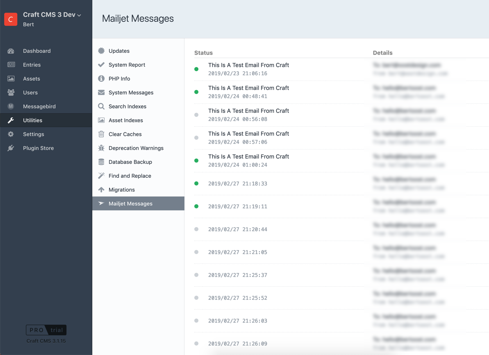

<p align="center"></p>

<h1 align="center">Mailjet Email</h1>

Once Mailjet is installed, go to Settings → Email, and change the “Transport Type” setting to “Mailjet”. 
Enter your Mailjet API Key and API secret (which you can get from 
[app.mailjet.com/account/setup](https://app.mailjet.com/account/setup)), then click Save.

> **Tip:** The API Key and API Secret settings can be set to an environment variables. See [Environmental Configuration](https://docs.craftcms.com/v3/config/environments.html) in the Craft docs to learn more about that.

## How to use?

This is quite simple. Once the Mailjet adapter is configured, all you're emails are going to be send by Mailjet. Just use the Craft CMS mailer to send a message

### Example

```php
// use message object
use craft\mail\Message;

// find the user you want to email
$user = Craft::$app->getUsers()->getUserById(1);

// start new message
$message = new Message();
$message->setTo($user);
$message->setHtmlBody('<p>This is a test.</p>');
$message->setTextBody('This is a test.');

// sent it
Craft::$app->getMailer()->send($message);
```

## Utility

When the plugin detects that Craft's mailer is configured to use Mailjet, you will be able to find a Mailjet utility in Craft's Utility menu.

In this utility you can review the emails sent by the Mailjet API. This paginated lists are cached until the next email is sent.

